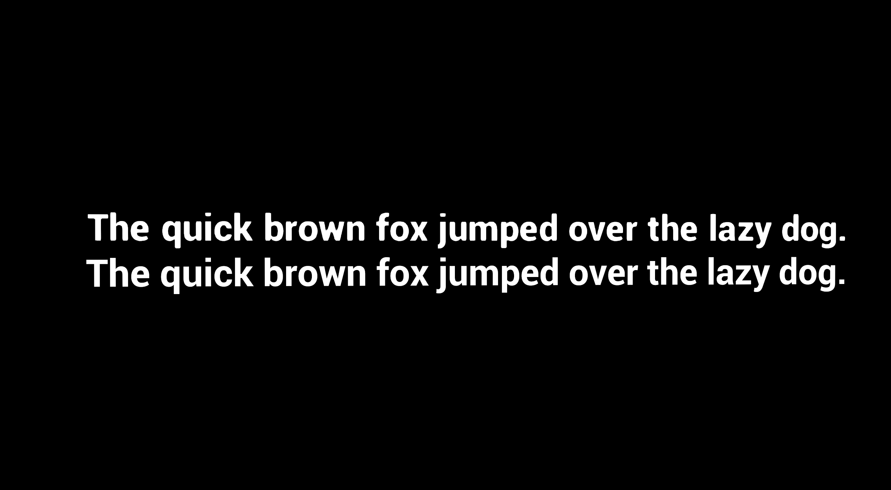
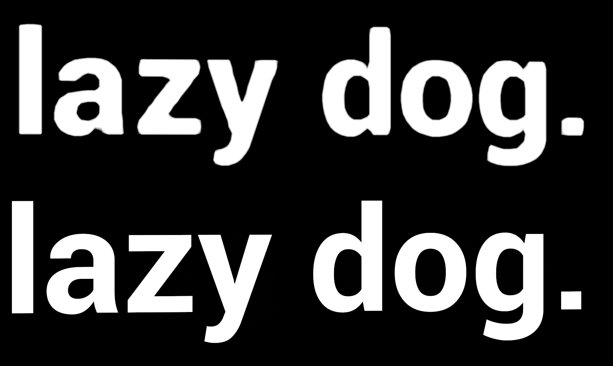

# Scanline Font Renderer Plugin
This plugin adds a 3d text rendering component `ScanlineTextRenderComponent` that uses The Scanline Sweeper glyph rendering algorithm described in [this video](https://www.youtube.com/watch?v=B9bztU1sTFA) and [this paper](https://rookandpossum.com/posts/scanline-sweeper/). 

# Usage Instructions
Right click any font face in the content browser and click "Create Scanline Font Face". Then place a `Scanline Text Render Actor` in the world and assign it the newly created scanline font face.

# Comparison to Unreal's Text Rendering Component
Compared to Unreal's built-in 3d text rendering method (signed distance field textures), the scanline sweeper algorithm smoothly and accurately rasterizes text at any size. Unreal's built in method rasterizes text to signed distance field textures offline before rendering the signed distance field texture per-pixel using the method described in [this paper](https://steamcdn-a.akamaihd.net/apps/valve/2007/SIGGRAPH2007_AlphaTestedMagnification.pdf). This method depends on the texel density of the generated signed distance field to accurately rasterize text, and as such when the texel density of the text is lower than native resolution, the text appears bloby and soft.

The scanline sweeper method does not suffer from this limitation, as it rasterizes the text per-pixel on screen using the font's original vector graphics. The downside of the scanline sweeper implementation is a **much higher** rendering cost per-pixel compared to the trivial rendering cost of the signed distance field method. This rendering cost is also dependent on the font's complexity (number of curves), whereas signed distance fields have a trivial and constant cost to render independent of font complexity.

See the screenshots below for a quality comparison.

## Comparison Screenshots
The top text is Unreal's built in text render component, the bottom is the ScanlineTextRenderComponent.

From far away, the text quality is similar.

Up close you can see how the ScanlineTextRenderComponent retains detail while Unreal's component appears bloby and smudgy.

# License
The shader code in Shaders/Private/ScanlineFontCommon.ush is licensed under the Mozilla Public License. Everything else is licensed under the MIT license.